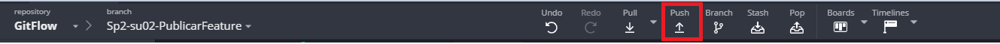
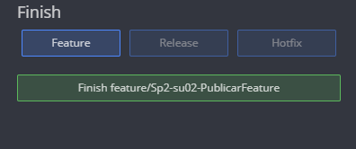
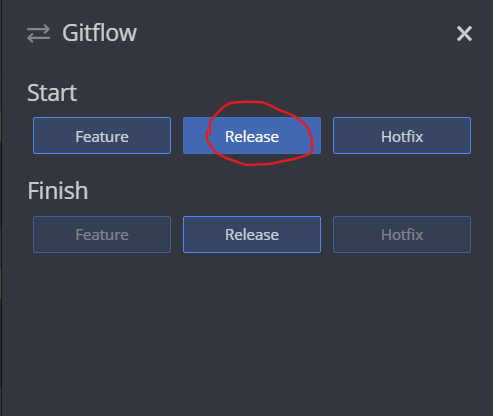
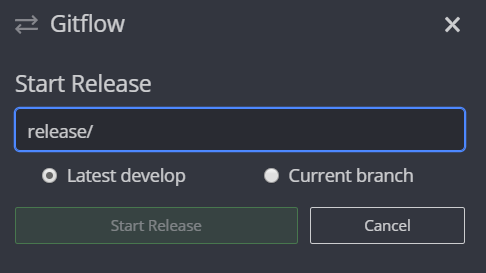

# Lab-Gitflow

En el siguiente laboratorio se implementará 
una calculadora estadística utilizando 
la metodología Gitflow. Para esto se necesitará lo siguiente:
    
 * Java 1.8
 * Maven
 * Git
 * GitKraken
 
 Primero se debe descargar el código inicial del laboratorio
 que cuenta con la estructura de los métodos que se van a implementar.
 
 El desarrollo se realizará en dos Sprints siguiendo la metodología  GitFlow.
 
 ## Consideraciones
 Para ejecutar el programa primero debe compilarlo utilizando 
 ```
mvn package
```
Luego ejecutarlo con el comando
```
mvn exec:java -D "exec.mainClass"="edu.eci.bp.App"
```
Si desea ejecutar las pruebas utilice el comando
```
mvn test
```
 ## Creando el repositorio
 Haga Fork a este repositorio para obtener el código base 
 e inicialice la estructura de GitFlow así :
 
```
git flow init 
```


O alternativamente en GitKraken, clonamos el repositorio y editamos las preferencias.


## Implementando features
Para el primer Sprint del laboratorio se tienen propuestos 2
features.
```
Sp1:su01:Implementar el método mean que calcule la media de un conjunto de datos dado
Sp1:su02:Implementar el método mode que calcula la moda del conjunto de datos dado
```
Se deben realizar las implementaciones correspondientes en la clase StatisticsModule.
Para cada feature crearemos una nueva rama utilizando el siguiente comando:
```
git flow feature start NOMBREFEATURE
``` 
O alternativamente en gitKraken 
De igual manera mediante GitKraken podemos hacer lo mismo de la siguiente manera:


Esto creara una nueva rama con el prefijo feature/ y el nombre que le asignemos, para esto se puede utilizar el 
identificador del feature, es decir S01:Hu01 o S01:Hu02. En este punto ya podremos realizar la implementación necesaria.

## Publicando y Terminando features

Al crear lo features solo tenemos versiones locales de estos, por lo que si necesitamos
enviarlas al repositorio remoto usaremos el siguiente comando
```
git flow feature publish NOMBREFEATURE
```
En GitKraken es haciendo solamente un push de la rama que queremos



Una vez que terminamos de implementar la funcionalidad podemos cerrar la rama y unirla con el resto de lo que se ha 
desarrollado en el sprint, al hacer merge con la rama develop, para esto podemos usar el siguiente comando, teniendo 
en cuenta que se pueden producir conflictos que se deben solucionar manualmente.

``` git flow feature finish NOMBREFEATURE ```

En GitKraken en el panel de la izquierda vemos la opción de gitflow en la cual podemos finalizar de la rama que queremos




Utilizando este método se deben implementar los features propuestos para este sprint

## Iniciar un Release

Una vez terminadas las funcionalidades del sprint se crea un nuevo release, esto se hace únicamente cuando el código
esta listo par entregar a producción , en esta rama se hacen pruebas de QA y al iniciarse toma la ultima version de la rama develop

Para crear un release utilizamos el siguietne comando
 ``` git flow release start <nombre de version > ```
 


O utilizando GitKraken





### Finalizar un release

Es importante destacar que un release se finaliza cuando 
el proyecto está lo suficientemente avanzado para salir a producción,
o se encuentra listo para pruebas de integration.

para finalizar un release utilizamos el comando de consola

 ``` git flow release finish "Nombre de version" ```
 
Ejemplo:  


Nos pedirá añadir  un comentario para el tag de la versión  

  


 // Finalmente, se publica la version  
 ``` git push origin --tags ```

Y git nos muestra un resumen de lo realizado.  

  

## Sprint 2
Para el segundo sprint del proyecto tenemos la siguiente historia de usuario, que se propone para poner en práctica
la metodología propuesta por su cuenta.
```
Sp2:su03:Implementar el método standardDeviation que calcule la desviación estándar de un conjunto de datos dado
``` 

## HotFix 
Esta rama se utiliza para solucionar errores que se encuentran en producción, en este caso lo utilizaremos para 
cambiar los valores fijos del arreglo de datos en la clase App por cualquier conjunto de datos que desee.

Para esto utilizaremos el siguiente comando :
``` $ git flow hotfix start #VERSION ```

Con GitKraken podemos inicializar un hotfix de la siguiente forma:  

  

Se recomienda poner el nombre del hotfix con el versionamiento correspondiente. Ej: v1.1 - v0.1.1.  

Una vez ya esten los cambios realizados, debido a que Hotfix no posee un comando de publicación  
basta con realizar el commit y usar el comando:  

``` $ git flow hotfix finish ```  

